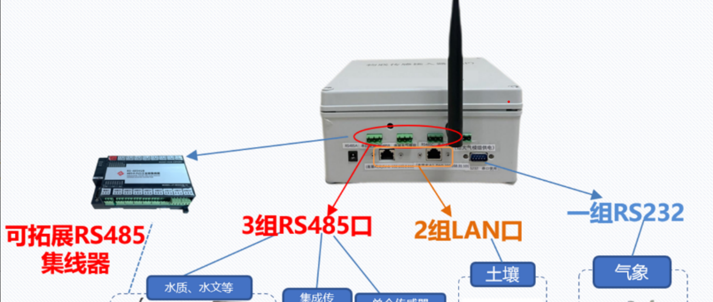

# TRLIB 智能网关系统

## 项目概述

SAP（接入设备)是一个用于物联网场景的智能网关系统，基于 **i.MX6UL+Linux** 平台，提供多接口通信、协议转换和智能网络选择功能。系统作为智能网关和服务器之间的桥梁，管理设备连接、采集数据、处理通信协议、转发数据，并提供离线缓存能力。

核心功能包括：

- 多通信接口管理（WiFi、LoRa、蓝牙、4G、有线网络）
- 私有协议实现与转换
- 智能网络选择
- 断线重连与离线数据缓存
- 事件驱动的异步处理架构

## 设备连接

系统支持以下物理接口：

- **WiFi**: 通过hostapd创建AP模式接入点
- **LoRa**: 通过串口与LoRa模块通信
- **蓝牙**: 通过串口与蓝牙模块通信
- **有线网络**: 通过Ethernet接口连接
- **4G**: 通过PPP拨号连接互联网

## 异常处理

系统实现了多种异常处理机制：

- 断线重连
- 心跳检测
- 超时重传
- 设备状态监控

## 适用场景

适用于以下场景：

- **环境监测系统**: 大气、水质、土壤等环境参数监测
- **智能工业物联网**: 工业设备连接与监控
- **智慧农业**: 农田监测、灌溉控制系统
- **分布式传感网络**: 大规模传感器数据采集